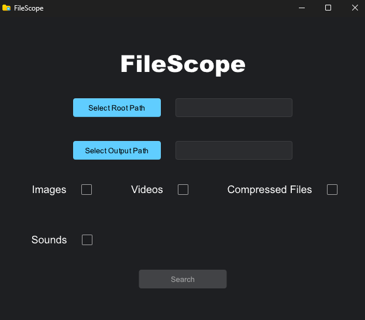

# FileScope

FileScope is a desktop application that quickly searches for videos, images, sounds, and compressed files within a selected directory. It uses multithreading for fast search operations and features an intuitive interface built with Slint, powered by Rust.

## Features

- **Search for Specific File Types**: Search for images, videos, sounds, and compressed files within any selected directory..
- **Multithreaded Search:**: Utilizes multiple threads for fast and efficient file searching.
- **User-Friendly Interface:**: Allows easy navigation through directories and file results.

## Technologies Used

- **Backend**: Rust
- **Frontend**: Slint

## Dependencies

This project uses the following dependencies:

```toml
[dependencies]
rayon = "1.10.0"
rfd = "0.15.2"
slint = "1.9.2"
walkdir = "2.5.0"
winresource = "0.1.19"

[build-dependencies]
slint-build = "1.9.2"
winresource = "0.1.19"
```

## How to Run

1. Clone the repository:

```bash
git clone https://github.com/Silen1t/FileScope
```

2. Navigate to the project directory:

```bash
cd FileScope
```

3. Build the project:
```bash
cargo build
```

4. Run the application:
```bash
cargo run
```

## Testing the Executable

To test the compiled executable application:

1. Build the project in release mode:
```bash
cargo build --release
```

2. Navigate to the target/release directory:
```bash
cd target/release
```

3. Run the executable file:
```bash
FileScope.exe
```

## Screenshots

### FileScope Interface



## Contributing

This project is currently maintained by a single developer and is not open for external contributions. However, feel free to explore the code, use it for learning, and share feedback or suggestions by opening an issue.

## License

This project is licensed under the CC0 1.0 License. See the LICENSE file for details.
